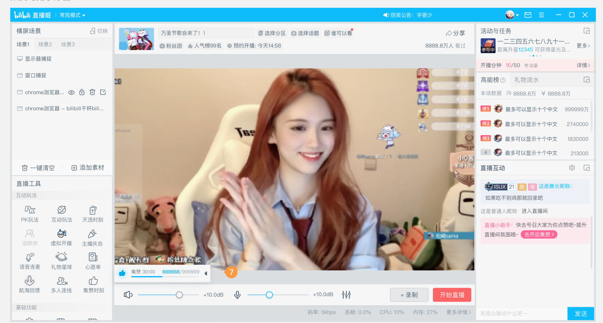

# 背景与问题重框

> **范围**：直播姬产品定位、问题诊断（三个失败模式）、从"体验问题"到"治理失败"的重框
> **在母话题里的角色**：解释为什么改版是治理干预而非视觉重做
> **状态**：🟢 进行中

## 事实

- [[直播姬]]定位：「B站直播官方内容生产（进阶）工具」，面向需要精细控制的高活跃主播（来源：源文件2 / 2026-05-21）
- 用研结论：66% 主播认为页面复杂难用、功能找不到（来源：源文件1+2 / 2026-05-21）
- NPS 基线：H2 月均 65-70%，较上半年下滑 3-8pp，11月起开始爬升（来源：源文件2+3 / 2026-05-21）
- 补充：源文件3数据目标表记录项目启动时瞬时值为 61%（易用性 72%、稳定性 67%）
- 各分区易用性不满意度：
  - 娱乐区 66.1%：页面布局不合理，找不到想要的功能
  - 虚拟区 63.3%：工具缺乏拓展性（无法使用第三方插件）
  - 生活知识区 62%：基础功能不全面
  - 娱乐区 58%：不易上手，需要查找教程
- 稳定性是最普遍的不满意项，各分层不满意度均超过 45%（稳定性不在本项目范围内）
- 竞品对比：
  - vs 抖音/快手：B站劣势是视觉风格滞后和历史交互积累问题；优势是功能丰富性
  - vs OBS：B站劣势是稳定性；优势是官方互动/数据/活动任务
  - B站独有：同时具备官方互动工具和三方插件支持（抖音/快手无三方插件，OBS 无官方互动）
- 项目范围外（不影响）：教程&客服知识库更新、虚拟开播皮肤
- 三个失败模式：
  1. [[开播链路]]碎片化：从"打开应用"到"开播"需跨多个断点，认知负荷高
  2. [[官方玩法]]激活成本高：入口不一致、无状态反馈，主播不知道发生了什么
  3. [[官方活动]]触达效率低：活动曝光无专属资源位，与自然 UI 竞争注意力
- 业务影响：官方工具使用率下降、官方能力渗透不足（来源：源文件2 / 2026-05-21）

**老版界面：**

## 判断

- 表层问题是可用性，根因是[[治理失败]]：无共享标准、无信息架构 owner、无新功能接入规则（来源：源文件1 / 2026-05-21）
- 不做治理干预、只刷视觉，18 个月内会复现相同问题（来源：源文件1 / 2026-05-21）

## 决策

- 将项目定性为"治理干预"而非"重设计"，先建立规则再修修表面（来源：源文件1 / 2026-05-21）

## 待办

- [ ] 确认"66%"用研的样本范围和时间
- [ ] 确认"18个月"估算的依据

## 与其他子话题的依赖

- 影响 02 的信息架构重构方向
- 影响 03、04 的"发现性"设计优先级

## 与母话题的同步点

- 项目定性（治理 vs 重设计）→ 已确认结论
- NPS 基线 65-70% → 已记录
