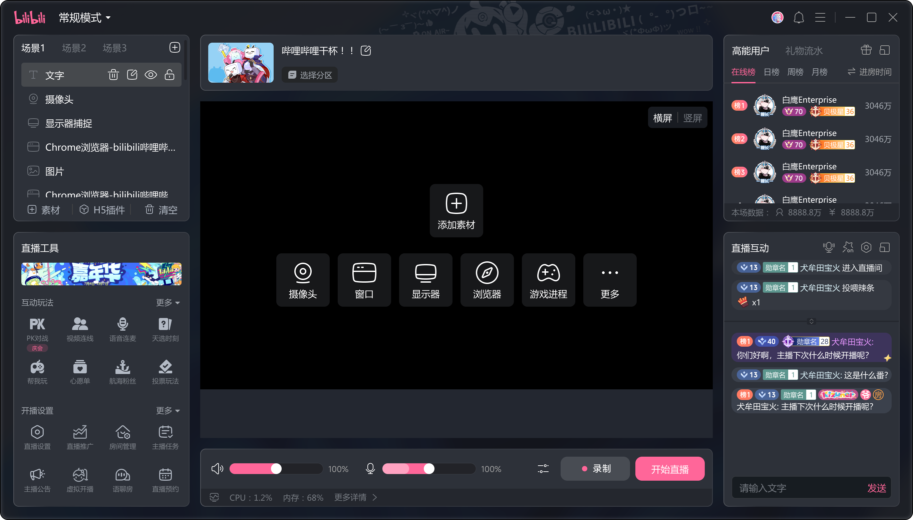

# 工作流01：全界面 UI 治理

> **范围**：230+ 页面审计、信息架构统一、设计系统建立
> **在母话题里的角色**：治理干预的核心执行，影响开播转化
> **状态**：🟢 进行中

## 事实

- 审计全量 230+ 页面，映射每个状态下的信息层级（来源：源文件1 / 2026-05-21）
- 识别了导航模式、标签命名、布局逻辑三类不一致（来源：源文件1 / 2026-05-21）
- 信息架构划分为 9 个模块：
  - 装修模块、基础信息模块
  - 工具模块（运营子模块 / 互动玩法子模块 / 直播设置子模块）
  - 实时监控模块（互动 / 画面 / 声音 / 性能 / 开播控制）
  - 在线用户模块、直播消息模块、顶部栏右上角
- 落地节奏：第一期（视觉&部分交互）/ 第二期（交互深化），目标上线日期 0815
- 开播转化率改前基线：75%，项目目标：+2pp
- 结果：[[开播转化]] +2.4pp（来源：源文件1+2 / 2026-05-21）

**新版界面（改版后）：**

## 判断

- 全量审计使得"最显眼的问题"之外的结构性失败也可见（来源：源文件1 / 2026-05-21）
- 模块定位原则：按「功能属性」而非「使用频率」划分归属，防止未来新功能归类混乱

## 决策

- 统一[[设计系统]]和信息结构后系统性应用，而非逐页修补

## 待办

- [ ] 补充审计方法细节（如何分类 230+ 页面？）

## 与其他子话题的依赖

- 依赖 01 的问题重框作为改版方向依据
- 影响 03、04 模块归属和资源位定义

## 与母话题的同步点

- 开播转化 +2.4pp → 已确认结论
