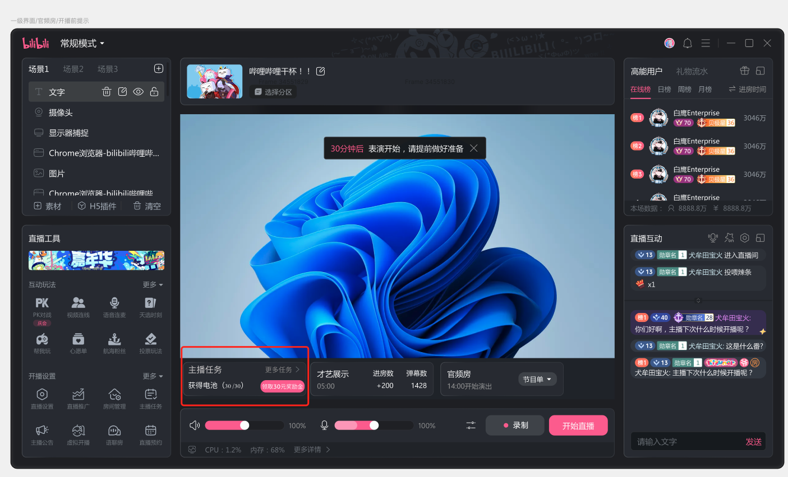
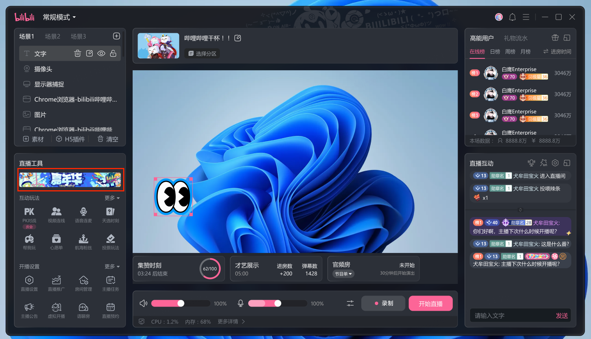

# 工作流02：官方互动功能优化

> **范围**：官方玩法的入口可发现性与实时状态反馈
> **在母话题里的角色**：解决官方能力渗透不足的核心路径
> **状态**：🟢 进行中

## 事实

- 功能不被使用的两个原因：找不到入口 + 开启后像黑盒（来源：源文件1 / 2026-05-21）
- 互动玩法入口渗透率改前基线：26%，项目目标：+2pp（来源：源文件3 / 2026-05-21）
- 历史互动挂件「较为独立和分散」，主播同时开启多玩法的决策成本高
- 具体设计动作拆解：
  1. 露出更多控件（扩展可发现范围）
  2. 优化控件排序（更受欢迎的互动工具靠前）
  3. 降噪无规则标签（降低认知负荷）
  4. 新增[[实时互动进度监控]]菜单（提升主播参与感与掌控感）
- 互动模块改版目标：「观众互动」置于工具模块第一栏，保证曝光
- 上线初期用户构成：第一批升级的主播更倾向于积极使用官方工具（早期采用者偏差）
- 结果：[[互动玩法渗透]] +17pp（来源：源文件1+2 / 2026-05-21）

**互动工具入口优化：**

**实时互动进度监控：**

## 判断

- +17pp 完全来自发现性和反馈摩擦的降低，功能本身未改动（来源：源文件1 / 2026-05-21）
- 短期设计目标：提升官方互动和玩法的[[收益感知]]（来源：源文件2 / 2026-05-21）
- 实际结果（+17pp）对目标（+2pp）的大幅超出，说明发现性摩擦的影响被显著低估
- +17pp 中包含两类贡献：设计机制改善（可持续）+ 早期采用者效应（可能随后续用户群扩大而稀释）
- 设计层面的贡献（发现性 + 反馈感知）是可复用的方法论，与功能本身无关，可迁移至其他模块

## 决策

- 优先解决"功能可感知性"而非改造功能逻辑

## 待办

- [ ] 在后续数据复盘中拆分早期采用者 vs 后续用户群的渗透率走势，验证长期稳态

## 与其他子话题的依赖

- 依赖 02 的模块定位和排序规则
- 影响 06 的结果解读（早期采用者效应说明）

## 与母话题的同步点

- 互动玩法渗透 +17pp → 已确认结论（含归因说明）
